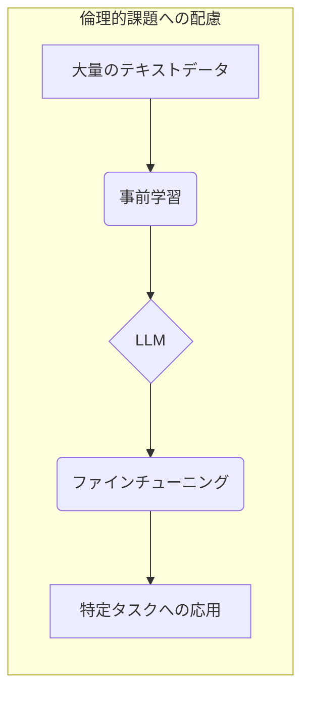
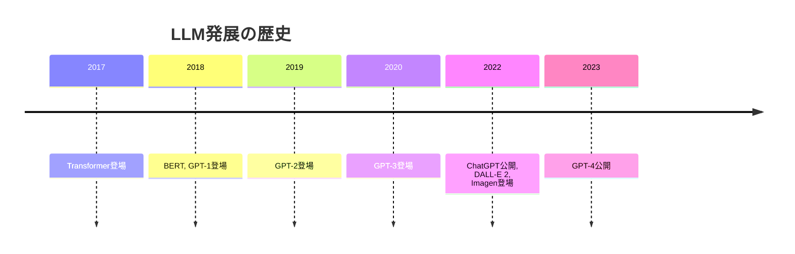

# doc_genai_About_types_of_large-scale_language_models_LLM
大規模言語モデル（LLM）の種類について

  

## 目次
- [大規模言語モデル（LLM）の種類と特徴](#大規模言語モデルllmの種類と特徴)
  - [1. LLM比較表](#1-llm比較表)
  - [2. LLM理解を深めるためのポイント](#2-llm理解を深めるためのポイント)
  - [3. LLM発展の歴史](#3-llm発展の歴史)

  
## 大規模言語モデル（LLM）の種類と特徴

大規模言語モデル（LLM: Large Language Model）は、膨大なテキストデータで学習され、人間のような自然な文章生成や様々なタスクをこなす人工知能です。本資料では、代表的なLLMの種類と、理解を深めるための情報をまとめます。

  
### 1. LLM比較表

| モデル名 | 提供元 | URL | 利用形態 | 機能 | 料金 | ライセンス | 商用利用 | コンテキスト長 | モデルサイズ | 補足情報 |
|---|---|---|---|---|---|---|---|---|---|---|

  
**凡例**

* **利用形態**: クラウドサービスとして提供されているか、ローカル環境で実行できるか
* **機能**: 主な機能 (チャットUI、Web APIなど)
* **料金**: 無料または有料
* **ライセンス**: 商用利用を許可するライセンス形態
* **商用利用**: 商用利用が可能かどうか
* **コンテキスト長**: モデルが一度に処理できるテキスト量 (トークン数で表示)
* **モデルサイズ**: モデルの規模 (パラメータ数で表示)
* **補足情報**: その他の特徴

  
**注記**: 表の内容は最新情報とは限らない場合があります。最新情報は各提供元の公式サイトをご確認ください。

  

### 2. LLM理解を深めるためのポイント

1. **アーキテクチャ**: 多くのLLMはTransformerという深層学習モデルをベースにしています。
2. **学習方法**: 大量のテキストデータを使った「事前学習」と、特定タスクに合わせた「ファインチューニング」が行われます。
3. **応用分野**: 自然言語処理、コード生成、画像生成など、様々な分野で活用されています。
4. **倫理的課題**: 偏見や偽情報の生成、プライバシー侵害など、解決すべき課題も存在します。

  
### 3. LLM発展の歴史

* 2017年: Transformerの登場
* 2018年: BERT, GPT-1などの登場
* 2019年: GPT-2の登場
* 2020年: GPT-3の登場
* 2022年: ChatGPTの公開, DALL-E 2, Imagenなどの画像生成AIが登場
* 2023年: GPT-4の公開

LLMは日々進化しており、今後も新しいモデルや技術が登場することが予想されます。

  

